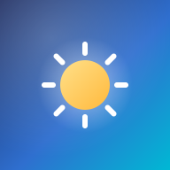

  

<h1 align="center">Seclusa Weather</h1>

  <em>A privacy-first weather PWA — zero tracking, no accounts, no API keys.</em>

  
  
  
  

  <a href="#features">Features</a> ·
  <a href="#privacy">Privacy</a> ·
  <a href="#installation">Installation</a> ·
  <a href="#license">License</a>

---

*Seclusa* — from the Latin meaning "private", "secluded", or "set apart" — keeps your weather your own. Seclusa Weather is a **pure static, open-source weather app**. Everything runs in your browser: preferences and a cached forecast live only on your device, and the only outbound requests are to the [Open-Meteo](https://open-meteo.com/) API and OpenStreetMap tiles. Installable, offline-capable, and auditable end-to-end.

---

## ✨ Features

### 🌡️ Forecast
- **Current conditions** — temperature, feels-like, humidity, pressure, wind, precipitation, UV, visibility
- **Hourly forecast** — scrollable 24h / all-day view with a multi-metric chart
  *(Temp & Dew · Rain · Wind · Humidity · Cloud · Pressure · Sun strength)*
- **Daily forecast** — 7-day or 14-day cards with a toggle
- **Sunrise/sunset arc** — a live SVG that shows the sun *and* moon arcing across your sky
- **Auto-refresh** — silently stays fresh every 30 minutes

### 🌍 Air & Environment
- **Air quality index** — EU or US AQI with PM2.5, PM10, NO₂, O₃, SO₂, CO breakdown
- **Pollen forecast** — alder, birch, grass, mugwort, olive, and ragweed levels
- **UV index** — color-coded badge with risk level

### 🗺️ Location
- **Static map** — OpenStreetMap tile with a location pin
- **Geolocation** — "use my location", fully opt-in, on button tap only

### 🎨 Interface
- **Dark / light themes** with dynamic weather backgrounds at sunrise, rain, snow, thunder, fog, and night
- **Metric / imperial toggle** — saved between visits
- **Touch & mouse drag gestures** on the hourly forecast
- Smooth fade-in animations, fully responsive

---

## 🔒 Privacy

Your data is your business. That's the whole point.

| | |
|---|---|
| 🚫 **Zero tracking** | No analytics, no cookies, no fingerprinting, no third-party scripts |
| 🖥️ **No server** | Pure static site — nothing runs on a server |
| 🔑 **No API key** | Powered by free open-source [Open-Meteo](https://open-meteo.com/), no account needed |
| 🏠 **Stays on device** | Preferences, last location, and cached forecast never leave your device |
| 📤 **What leaves** | Forecasts (with coordinates) go to Open-Meteo; map tiles come from OpenStreetMap. Nothing else |
| 🧹 **Self-cleaning cache** | Old cached data removes itself after 7 days |
| 📍 **Geolocation opt-in** | Only on button tap, sent only to Open-Meteo + OpenStreetMap |
| 🛡️ **Locked-down security** | The app can only reach the weather and map servers it actually needs |
| 🕵️ **No hidden sharing** | Nothing beyond the forecast request itself ever leaves your device |
| 🚫 **Camera & mic stay off** | Access to camera, microphone, motion sensors, and payment is blocked |
| 🖼️ **Can't be embedded** | The app won't run inside other websites (best-effort — GitHub Pages limits header support, and there's nothing to gain from embedding anyway) |
| 📜 **Open source** | GPL-3.0 — read every line |

> ⚠️ **Geolocation note:** your coordinates *are* sent to the weather API when you view a forecast or the map. It's the only way to get a local forecast — but it's disclosed, opt-in, and never logged or shared.

---

## 📦 Installation

### Use it
Open the live site in your browser and install it as a PWA:

1. Open the site
2. Tap **Install** / **Add to Home screen**
3. Done — it works offline too

> 💡 Want maximum security? On Android use a hardened browser like **Vanadium (GrapheneOS)** or **Brave** for any PWA.

---

## ⚠️ Disclaimer

> This project was **vibe-coded**. All code is reviewed before each release, but it's still recommended to audit for security flaws before use, especially when self-hosting. Use at your own risk.

---

## 📄 License

[GPL-3.0](LICENSE) — free to use, modify, and share, with the same freedom preserved for derivatives.

---
